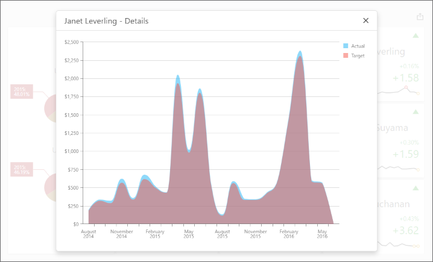

<!-- default badges list -->

<!-- default badges end -->

# ASP.NET Core Dashboard - How to obtain a dashboard item's client data

The example uses the Dashboard Control's [client-side API](https://docs.devexpress.com/Dashboard/400192/web-dashboard/aspnet-core-dashboard-control/client-side-api-overview) to obtain client data that corresponds to a particular visual element. When you click a card, [dxChart](https://js.devexpress.com/DevExtreme/ApiReference/UI_Components/dxChart/) displays the detailed chart and shows a variation of actual/target values over time.

The [ViewerApiExtensionOptions.onItemClick](https://docs.devexpress.com/Dashboard/js-DevExpress.Dashboard.ViewerApiExtensionOptions?p=netframework#js_devexpress_dashboard_viewerapiextensionoptions_onitemclick) event is handled to obtain client data and invoke the [dxPopup](https://js.devexpress.com/DevExtreme/ApiReference/UI_Components/dxPopup/) component with the `dxChart`.

In the event handler, the `e.getData` method is called to obtain dashboard item's client data. The `e.getAxisPoint` method returns the axis point that corresponds to the clicked card while the [ItemData.getSlice](https://docs.devexpress.com/Dashboard/js-DevExpress.Dashboard.Data.ItemData?p=netframework#js_devexpress_dashboard_data_itemdata_getslice_value_) method returns the slice of client data by this axis point.

The [ItemDataAxis.getPoints](https://docs.devexpress.com/Dashboard/js-DevExpress.Dashboard.Data.ItemDataAxis#js_devexpress_dashboard_data_itemdataaxis_getpoints) method is used to obtain axis points that belong to the "Sparkline" data axis. Corresponding actual/target values are obtained using the [ItemData.getDeltaValue(deltaId)](https://docs.devexpress.com/Dashboard/js-DevExpress.Dashboard.Data.ItemData#js_devexpress_dashboard_data_itemdata_getdeltavalue_deltaid_) method.

## Files to Review
- [ClientData.js](./CS/AspNetCoreDashboard_ClientData/wwwroot/js/ClientData.js)
- [_Layout.cshtml](./CS/AspNetCoreDashboard_ClientData/Pages/_Layout.cshtml)
- [Index.cshtml](./CS/AspNetCoreDashboard_ClientData/Pages/Index.cshtml)

## Documentation

- [Client-Side API Overview for ASP.NET Core Dashboard](https://docs.devexpress.com/Dashboard/400192/web-dashboard/aspnet-core-dashboard-control/client-side-api-overview)
- [Obtain Underlying and Displayed Data in the ASP.NET Core Dashboard Control](https://docs.devexpress.com/Dashboard/403990)
- [Obtain Underlying and Displayed Data in Dashboard Control for JavaScript Applications
](https://docs.devexpress.com/Dashboard/403003/web-dashboard/dashboard-control-for-javascript-applications-jquery-knockout-etc/obtain-underlying-and-displayed-data)

## More Examples

- [Dashboard for ASP.NET Core - How to obtain a dashboard item's underlying data for a clicked visual element](https://github.com/DevExpress-Examples/asp-net-core-dashboard-get-underlying-data-for-clicked-item)
- [Dashboard for ASP.NET Core - How to obtain underlying data for the specified dashboard item](https://github.com/DevExpress-Examples/asp-net-core-dashboard-display-item-underlying-data)
- [Dashboard for MVC - How to obtain a dashboard item's client data](https://github.com/DevExpress-Examples/asp-net-mvc-dashboard-get-client-data)
- [Dashboard for MVC - How to obtain underlying data for the specified dashboard item](https://github.com/DevExpress-Examples/asp-net-mvc-dashboard-display-item-underlying-data)
- [Dashboard for MVC - How to obtain a dashboard item's underlying data for a clicked visual element](https://github.com/DevExpress-Examples/asp-net-mvc-dashboard-get-underlying-data-for-clicked-item)
- [Dashboard for Web Forms - How to obtain a dashboard item's client data](https://github.com/DevExpress-Examples/how-to-obtain-a-dashboard-items-client-data-in-the-aspnet-dashboard-control-t492284)
- [Dashboard for Web Forms - How to obtain a dashboard item's underlying data for a clicked visual element](https://github.com/DevExpress-Examples/aspxdashboard-how-to-obtain-a-dashboard-items-underlying-data-for-a-clicked-visual-element-t492257)
- [Dashboard for Web Forms - How to obtain underlying data for the specified dashboard item](https://github.com/DevExpress-Examples/aspxdashboard-how-to-obtain-underlying-data-for-the-specified-dashboard-item-t518504)
